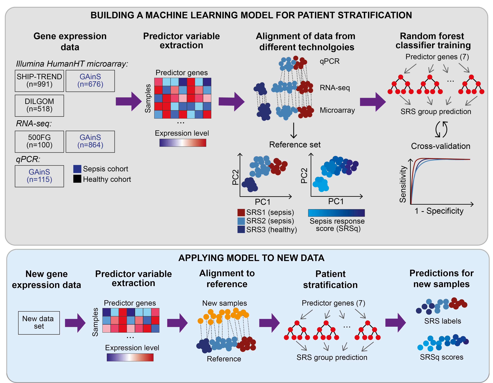

<!-- README.md is generated from README.Rmd. Please edit that file -->

```{r, include = FALSE}
knitr::opts_chunk$set(
  collapse = TRUE,
  comment = "#>",
  fig.path = "man/figures/README-",
  fig.align="center",
  out.width = "100%"
)
```

# SepstratifieR

<!-- badges: start -->
<!-- badges: end -->

The goal of SepstratifieR is to stratify patients with suspected infection into groups with different molecular characteristics. This is done based on the expression level of 7 genes measured from whole blood.

License: MIT + file LICENSE

## Installation

You can install the development version of SepstratifieR from [GitHub](https://github.com/) with:

``` r
# install.packages("devtools")
devtools::install_github("jknightlab/SepstratifieR")
```
## Details

### Background
This package is designed to stratify patients with suspected infectious disease into different molecular groups based on a sample of their gene expression from whole blood. These molecular groups are defined based on a signature of 7 genes, and are referred to as sepsis response signature (SRS) groups.

There are three SRS groups, which are as follows:

SRS1 = Composed of sepsis patients with an immunosupressed profile. These individuals are often at high risk of mortality.

SRS2 = Composed of sepsis patients with an immunocompetent profile. These individuals are at lower risk of mortality.

SRS3 = Formed of healthy individuals or patients with mild infection.


For more information on how SRS groups were originally defined, please refer to the following publications:

https://doi.org/10.1016/S2213-2600(16)00046-1

https://doi.org/10.1164/rccm.201608-1685OC

### The stratification algorithm
To perform stratification on a group of patient samples (i.e. the user's input), SepstratifieR first aligns the input samples to a reference data set containing gene expression profiles from healthy individuals and sepsis patients. This alignment is performed using the mutual nearest neighbours (mNN) algorithm for batch correction. This has the purpose of bringing the predictor variables to the desired scale. 

Next, the samples are classified into SRS groups based on a previously trained random forest model. In addition, each sample is also assigned a quantitative sepsis response score (SRSq) based on a second random forest prediction model. This score (SRSq) goes from 0 to 1. Patients with SRSq close to zero are likely to be healthy, while patients with SRSq close to one are at high risk.

The diagram below describes how the models used by SepstratifieR were built (top panel), as well as how the package's functions perform alignment and classification (bottom panel):



### Input format
The input expected by this function is a data frame object with rows corresponding to individuals/samples and columns corresponding to genes. This data frame must contain at least the following seven columns: 

ENSG00000152219, ENSG00000100814, ENSG00000127334, ENSG00000131355, ENSG00000137337, ENSG00000156414, and ENSG00000115085. 

If more columns are present, they will simply be ignored.

We recommend removing any technical batch effects from the input data set before calling this function. In addition, the predictor variables should have a roughly symmetric distribution. Thus, a transformation step is often useful. While this is often not a problem for microarray data sets, we recommend log-transforming any RNA-sequencing and qPCR data before prediction.

## Example code
Below is a basic example which shows you how to use this package to stratify a small set of patients into sepsis reponse groups:

```{r example}
# Load package
library(SepstratifieR)

# Load test data set
data(test_data)
head(test_data)

# Stratify patients
predictions <- stratifyPatients(test_data)
```

The results from this prediction look as follows:
```{r example_output}
predictions
```

Futhermore, you can use SepstratifieR's built-in plotting function to check whether the input samples were successfully mapped to the reference set and if there are any clear outliers.

```{r example_plot}
plotAlignedSamples(predictions)
```

## Contact
Eddie Cano-Gamez:  ecg@well.ox.ac.uk
