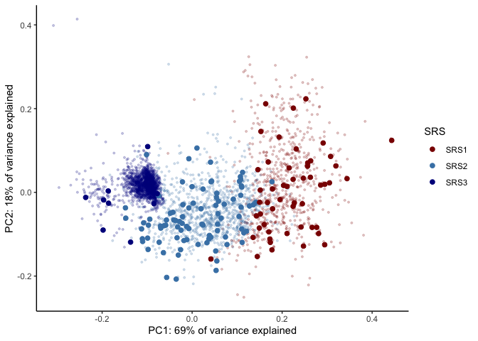
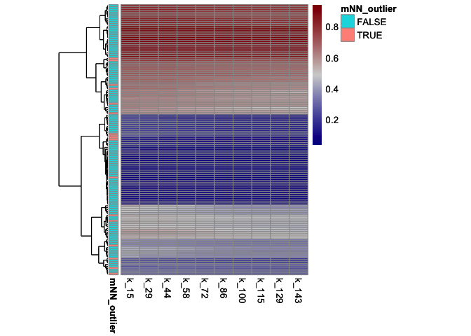
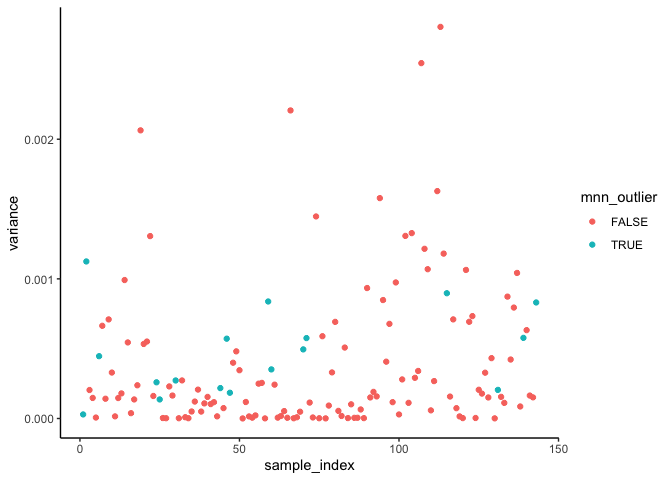
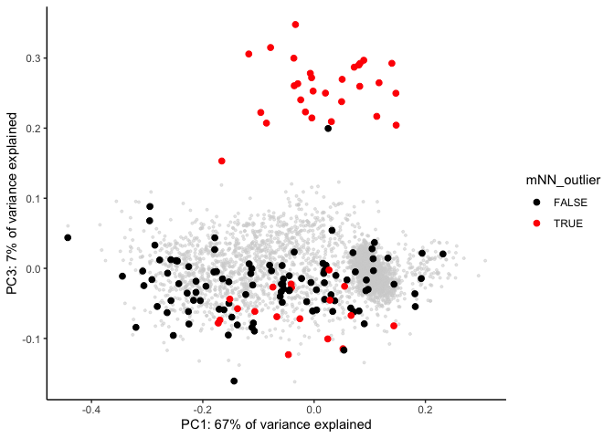
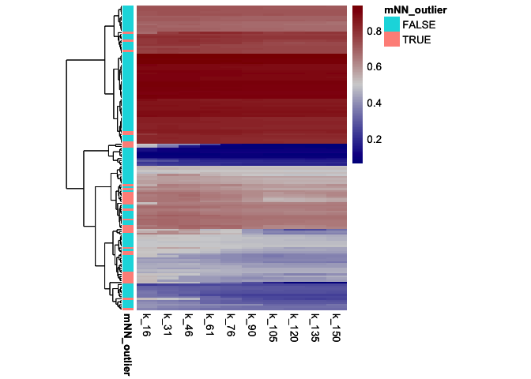
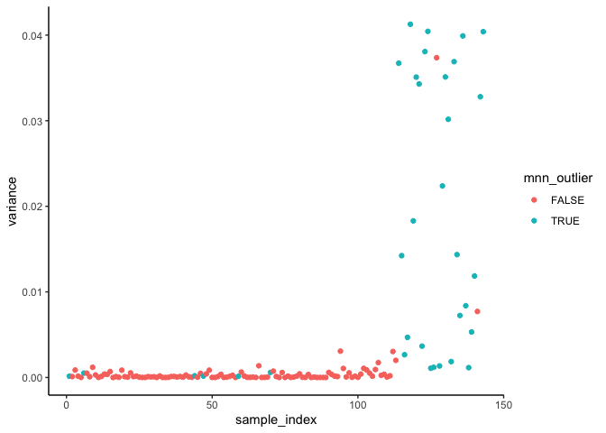

<!-- README.md is generated from README.Rmd. Please edit that file -->

# SepstratifieR

<!-- badges: start -->
<!-- badges: end -->

The goal of SepstratifieR is to stratify patients with suspected
infection into groups with different molecular characteristics. This is
done based on the expression level of 7 genes measured from whole blood.

License: MIT + file LICENSE

## Installation

You can install the development version of SepstratifieR from
[GitHub](https://github.com/) with:

``` r
# Install dependencies
if (!requireNamespace("BiocManager", quietly = TRUE))
    install.packages("BiocManager")
    
BiocManager::install("batchelor")


# Install SepstratifieR
# install.packages("devtools")
devtools::install_github("jknightlab/SepstratifieR")
```

## Details

### Background

This package is designed to stratify patients with suspected infectious
disease into different molecular groups based on a sample of their gene
expression from whole blood. These molecular groups are defined based on
a signature of 7 genes, and are referred to as sepsis response signature
(SRS) groups.

There are three SRS groups, which are as follows:

SRS1 = Composed of sepsis patients with an immunosupressed profile.
These individuals are often at high risk of mortality.

SRS2 = Composed of sepsis patients with an immunocompetent profile.
These individuals are at lower risk of mortality.

SRS3 = Formed of healthy individuals or patients with mild infection.

For more information on how SRS groups were originally defined, please
refer to the following publications:

<https://doi.org/10.1016/S2213-2600(16)00046-1>

<https://doi.org/10.1164/rccm.201608-1685OC>

### The stratification algorithm

To perform stratification on a group of patient samples (i.e. the user’s
input), SepstratifieR first aligns the input samples to a reference data
set containing gene expression profiles from healthy individuals and
sepsis patients. This alignment is performed using the mutual nearest
neighbours (mNN) algorithm for batch correction. This has the purpose of
bringing the predictor variables to the desired scale.

Next, the samples are classified into SRS groups based on a previously
trained random forest model. In addition, each sample is also assigned a
quantitative sepsis response score (SRSq) based on a second random
forest prediction model. This score (SRSq) goes from 0 to 1. Patients
with SRSq close to zero are likely to be healthy, while patients with
SRSq close to one are at high risk.

The diagram below describes how the models used by SepstratifieR were
built (top panel), as well as how the package’s functions perform
alignment and classification (bottom panel):


### Input format

The input expected by this function is a data frame object with rows
corresponding to individuals/samples and columns corresponding to genes.
This data frame must contain at least the following seven columns:

ENSG00000152219, ENSG00000100814, ENSG00000127334, ENSG00000131355,
ENSG00000137337, ENSG00000156414, and ENSG00000115085.

If more columns are present, they will simply be ignored.

We recommend removing any technical batch effects from the input data
set before calling this function. In addition, the predictor variables
should have a roughly symmetric distribution. Thus, a transformation
step is often useful. While this is often not a problem for microarray
data sets, we recommend log-transforming any RNA-sequencing and qPCR
data before prediction.

## A brief example

Below is a basic example which shows you how to use this package to
stratify a small set of patients into sepsis reponse groups:

``` r
# Load package
library(SepstratifieR)

# Load test data set
data(test_data)
head(test_data)
#>    ENSG00000152219 ENSG00000100814 ENSG00000127334 ENSG00000131355
#> s1        3.319700        2.571562        3.775363        5.417076
#> s2        3.595249        2.040987        5.165325        6.504772
#> s3        3.295334        2.032406        5.172078        6.501616
#> s4        2.670693        1.983178        3.387407        6.161274
#> s5        2.080137        1.612451        3.287325        5.364442
#> s6        3.319166        2.176933        3.643455        5.587000
#>    ENSG00000137337 ENSG00000156414 ENSG00000115085
#> s1        3.693679        7.985685        4.372800
#> s2        4.365816        7.156300        5.829096
#> s3        3.584690        7.473547        5.926678
#> s4        2.945092        5.955904        4.463134
#> s5        3.108978        8.490427        3.532612
#> s6        4.068081        6.399496        5.358397

# Stratify patients
predictions <- stratifyPatients(test_data)
#> Fetching predictor variables...
#> 
#> Aligning data to the reference set...
#> Number of nearest neighours set to k=20
#> Identifying potential outlier samples...
#> Stratifying samples into sepsis response signature (SRS) groups...
#> Assigning samples a quantitative sepsis response signature score (SRSq)...
#> ... done!
```

The results from this prediction look as follows:

``` r
predictions
#> SepsisPrediction
#> 
#> 150 samples
#> 7 predictor variables
#> 
#> Predictor variables: ENSG00000152219, ENSG00000100814, ENSG00000127334, ENSG00000131355, ...
#> Sample names: s1, s2, s3, s4, ...
#> SRS: SRS1, SRS2, SRS2, SRS1, ...
#> SRSq: 0.9136852, 0.7710878, 0.7948279, 0.8327578, ...
```

Futhermore, you can use SepstratifieR’s built-in plotting function to
check whether the input samples were successfully mapped to the
reference set and if there are any clear outliers.

``` r
plotAlignedSamples(predictions)
```



## Setting the number of mutual nearest neighbout (k)

Perhaps the most important parameter to take into account when
performing patient stratification is the number of mutual nearest
neighbouts in the data alignment step (k). The impact of this parameter
on data integration has been previously summarized in the documentation
of mNN (<https://rdrr.io/github/LTLA/batchelor/man/fastMNN.html>).

In brief, lower values of ‘k’ will retain more substructure in the input
data, with samples that do not closely resemble the reference set being
flagged as outliers (i.e. samples for which no mutual nearest neighbor
was found). Conversely, higher values of ‘k’ will result in a more
lenient and aggressive merging, where samples are forced to align with
the reference data even if they differ in certain aspects. Higher values
of ‘k’ often result in better performance of data integration, but can
also cause outliers to pass undetected, especially when a small group of
samples is not well represented in the reference set.

The authors of mNN suggest that ‘k’ be set to the expected size for the
smallest subpopulation. Based on the proportion of individuals from
different sepsis response (SRS) groups previously reported in the
context of a sepsis patients in intensive care, we recommend that this
parameter be set to 20-30% the number of input samples. However, please
not that this value might not be ideal if you are using this algorithm
in a different patient population.

In the section below we explain how to assess if the predictions
obtained with SepstratifieR are robust to the choice of ‘k’.

## Running a sensitivity analysis

It is often unclear which value of ‘k’ is appropriate for a specific
analysis. Moreover, if ‘k’ is low, many samples might be flagged as
potential outliers by SepstratifieR, and it can be difficult to
distinguish whether they are true outliers or simply samples which
remained unmapped in the mNN step.

The best way to tackle both of these problems is by performing a
sensitivity analysis. In this analysis, patient stratification and SRS
prediction are repeatedly performed for a range of ‘k’ values, and the
results from each iteration are compared to each other so as to assess
their stability.

SepstratifieR has a built in function for sensitivity analysis. You can
run this function on the same input use for patient stratification, as
shown below:

``` r
sensitivity_results <- runSensitivityAnalysis(test_data)
#> The k parameter will iterate through: 16 31 46 61 76 90 105 120 135 150 
#> Predicting SRSq scors at all k values...
#> 
#> Fetching predictor variables...
#> 
#> Aligning data to the reference set...
#> Number of nearest neighours set to k=16
#> Identifying potential outlier samples...
#> Stratifying samples into sepsis response signature (SRS) groups...
#> Assigning samples a quantitative sepsis response signature score (SRSq)...
#> ... done!
#> 
#> Fetching predictor variables...
#> 
#> Aligning data to the reference set...
#> Number of nearest neighours set to k=31
#> Identifying potential outlier samples...
#> Stratifying samples into sepsis response signature (SRS) groups...
#> Assigning samples a quantitative sepsis response signature score (SRSq)...
#> ... done!
#> 
#> Fetching predictor variables...
#> 
#> Aligning data to the reference set...
#> Number of nearest neighours set to k=46
#> Identifying potential outlier samples...
#> Stratifying samples into sepsis response signature (SRS) groups...
#> Assigning samples a quantitative sepsis response signature score (SRSq)...
#> ... done!
#> 
#> Fetching predictor variables...
#> 
#> Aligning data to the reference set...
#> Number of nearest neighours set to k=61
#> Identifying potential outlier samples...
#> Stratifying samples into sepsis response signature (SRS) groups...
#> Assigning samples a quantitative sepsis response signature score (SRSq)...
#> ... done!
#> 
#> Fetching predictor variables...
#> 
#> Aligning data to the reference set...
#> Number of nearest neighours set to k=76
#> Identifying potential outlier samples...
#> Stratifying samples into sepsis response signature (SRS) groups...
#> Assigning samples a quantitative sepsis response signature score (SRSq)...
#> ... done!
#> 
#> Fetching predictor variables...
#> 
#> Aligning data to the reference set...
#> Number of nearest neighours set to k=90
#> Identifying potential outlier samples...
#> Stratifying samples into sepsis response signature (SRS) groups...
#> Assigning samples a quantitative sepsis response signature score (SRSq)...
#> ... done!
#> 
#> Fetching predictor variables...
#> 
#> Aligning data to the reference set...
#> Number of nearest neighours set to k=105
#> Identifying potential outlier samples...
#> Stratifying samples into sepsis response signature (SRS) groups...
#> Assigning samples a quantitative sepsis response signature score (SRSq)...
#> ... done!
#> 
#> Fetching predictor variables...
#> 
#> Aligning data to the reference set...
#> Number of nearest neighours set to k=120
#> Identifying potential outlier samples...
#> Stratifying samples into sepsis response signature (SRS) groups...
#> Assigning samples a quantitative sepsis response signature score (SRSq)...
#> ... done!
#> 
#> Fetching predictor variables...
#> 
#> Aligning data to the reference set...
#> Number of nearest neighours set to k=135
#> Identifying potential outlier samples...
#> Stratifying samples into sepsis response signature (SRS) groups...
#> Assigning samples a quantitative sepsis response signature score (SRSq)...
#> ... done!
#> 
#> Fetching predictor variables...
#> 
#> Aligning data to the reference set...
#> Number of nearest neighours set to k=150
#> Identifying potential outlier samples...
#> Stratifying samples into sepsis response signature (SRS) groups...
#> Assigning samples a quantitative sepsis response signature score (SRSq)...
#> ... done!
#> 
#> Identifying mNN outliers at k=31...
#> Estimating variance in SRSq prediction for different values of k...Plotting SRSq predictions as a function of k...
```



    #> Plotting variance in SRSq estimation for each sample...



    #> ...done!

The heatmap above clearly shows that the quantitative predictions from
SepstratifieR (SRSq) are robust to the choice of ‘k’, as they do not
seem to change. In addition, when computing the variability in predicted
SRSq scores across all of the evaluated values of ‘k’, we obtain a very
low variance, as shown in the scatter plot. Finally, because samples
flagged as outliers are randomly distributed in the plot and do not show
a higher variance compared to the rest of the data, we can be fairly
confident that they are not true outliers.

Now let’s see how this would look like if a group of outlier samples
were present in the input data.

We begin by artificially increasing the expression levels of ARL14EP for
the last 30 samples in the data set.

``` r
test_data$ENSG00000152219[121:150] <- test_data$ENSG00000152219[121:150] + rnorm(30, mean=8, sd=1)

tail(test_data)
#>      ENSG00000152219 ENSG00000100814 ENSG00000127334 ENSG00000131355
#> s145        12.13944        2.593291        3.894594        6.461857
#> s146        10.89178        2.341779        3.322335        6.210055
#> s147        10.23396        1.407762        4.102318        4.683783
#> s148        10.35916        1.844906        2.369607        6.635254
#> s149        11.84333        2.905245        3.302671        6.497499
#> s150        11.66735        2.375474        4.327059        7.139205
#>      ENSG00000137337 ENSG00000156414 ENSG00000115085
#> s145        2.854003        4.667498        4.960511
#> s146        2.817602        7.331545        5.882990
#> s147        3.400939        7.829079        4.792407
#> s148        1.904882        7.525440        5.080475
#> s149        2.945531        7.103185        5.874289
#> s150        2.751121        6.140037        5.385025
```

These samples should now act as a subgruop of outliers and, indeed, they
very clearly separate along PC3.

``` r
preds <- stratifyPatients(test_data, verbose=F)
plotAlignedSamples(preds, pcs=c(1,3), color_by = "mNN_outlier")
```



To confirm this, let’s now re-run the sensitivity analysis on this data
set. Notice how now the scatter plot clearly shows that the group of
samples set as outliers has higher variance in their SRSq estimations.
Indeed, most of them are correctly flagged as outliers during mNN
alignment. You can also see this in the heatmap, where the SRSq value
estimated for the outlier samples abruptly decreases as ‘k’ increases.

``` r
sensitivity_results <- runSensitivityAnalysis(test_data)
#> The k parameter will iterate through: 16 31 46 61 76 90 105 120 135 150 
#> Predicting SRSq scors at all k values...
#> 
#> Fetching predictor variables...
#> 
#> Aligning data to the reference set...
#> Number of nearest neighours set to k=16
#> Identifying potential outlier samples...
#> Stratifying samples into sepsis response signature (SRS) groups...
#> Assigning samples a quantitative sepsis response signature score (SRSq)...
#> ... done!
#> 
#> Fetching predictor variables...
#> 
#> Aligning data to the reference set...
#> Number of nearest neighours set to k=31
#> Identifying potential outlier samples...
#> Stratifying samples into sepsis response signature (SRS) groups...
#> Assigning samples a quantitative sepsis response signature score (SRSq)...
#> ... done!
#> 
#> Fetching predictor variables...
#> 
#> Aligning data to the reference set...
#> Number of nearest neighours set to k=46
#> Identifying potential outlier samples...
#> Stratifying samples into sepsis response signature (SRS) groups...
#> Assigning samples a quantitative sepsis response signature score (SRSq)...
#> ... done!
#> 
#> Fetching predictor variables...
#> 
#> Aligning data to the reference set...
#> Number of nearest neighours set to k=61
#> Identifying potential outlier samples...
#> Stratifying samples into sepsis response signature (SRS) groups...
#> Assigning samples a quantitative sepsis response signature score (SRSq)...
#> ... done!
#> 
#> Fetching predictor variables...
#> 
#> Aligning data to the reference set...
#> Number of nearest neighours set to k=76
#> Identifying potential outlier samples...
#> Stratifying samples into sepsis response signature (SRS) groups...
#> Assigning samples a quantitative sepsis response signature score (SRSq)...
#> ... done!
#> 
#> Fetching predictor variables...
#> 
#> Aligning data to the reference set...
#> Number of nearest neighours set to k=90
#> Identifying potential outlier samples...
#> Stratifying samples into sepsis response signature (SRS) groups...
#> Assigning samples a quantitative sepsis response signature score (SRSq)...
#> ... done!
#> 
#> Fetching predictor variables...
#> 
#> Aligning data to the reference set...
#> Number of nearest neighours set to k=105
#> Identifying potential outlier samples...
#> Stratifying samples into sepsis response signature (SRS) groups...
#> Assigning samples a quantitative sepsis response signature score (SRSq)...
#> ... done!
#> 
#> Fetching predictor variables...
#> 
#> Aligning data to the reference set...
#> Number of nearest neighours set to k=120
#> Identifying potential outlier samples...
#> Stratifying samples into sepsis response signature (SRS) groups...
#> Assigning samples a quantitative sepsis response signature score (SRSq)...
#> ... done!
#> 
#> Fetching predictor variables...
#> 
#> Aligning data to the reference set...
#> Number of nearest neighours set to k=135
#> Identifying potential outlier samples...
#> Stratifying samples into sepsis response signature (SRS) groups...
#> Assigning samples a quantitative sepsis response signature score (SRSq)...
#> ... done!
#> 
#> Fetching predictor variables...
#> 
#> Aligning data to the reference set...
#> Number of nearest neighours set to k=150
#> Identifying potential outlier samples...
#> Stratifying samples into sepsis response signature (SRS) groups...
#> Assigning samples a quantitative sepsis response signature score (SRSq)...
#> ... done!
#> 
#> Identifying mNN outliers at k=31...
#> Estimating variance in SRSq prediction for different values of k...Plotting SRSq predictions as a function of k...
```



    #> Plotting variance in SRSq estimation for each sample...



    #> ...done!

Under this last scenario, the sensitivity analysis suggests we should
exclude at least a subset of the samples flagged as outliers.

## Contact

Eddie Cano-Gamez: <ecg@well.ox.ac.uk>
